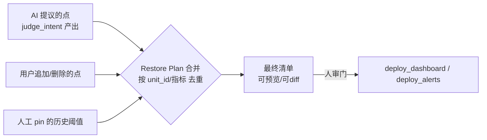
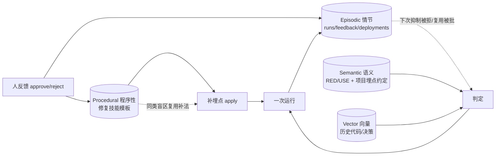

# Sentinel 开发文档（DESIGN）

> 本文件是项目的**北极星**。任何编码前先对照它；方向有变先改本文，再改代码。
> 约定：本文中文为主；**代码注释中文**、**所有 Prompt 中英双语双版本**（见 §15 开发规范）。

---

## 0. 项目定位与北极星

**一句话定位**：面向**多人协作**大型代码库的**可观测性守护 Agent**——读懂他人代码的业务意图，识别监控盲区，自动补齐埋点/看板/告警，并防止可观测性随提交而退化。

**痛点（真实来源）**：
- 大仓多人维护：我今天补了埋点，别人明天加了 feature 没补。
- 我看不懂、也没时间看别人写的代码，更不知道对他的业务「哪些行为重要、该打 log」。
- 规则脚本做不到「理解语义/业务意图」——这是必须上 LLM 的地方。

**术语体系（贯穿全项目，讲述统一）**：

| 术语 | 含义 |
|---|---|
| **Baseline 基线** | 一个模块「应该」具备的可观测性（该打的点 / 指标 / 告警） |
| **Drift 漂移** | 实际代码低于基线的差距（新代码没埋点、监控缺失） |
| **Coverage 覆盖度** | 当前达到基线的比例（对应评估的 Recall/F1） |
| **Restore 修复** | Agent 自动补齐到基线（埋点 / 看板 / 告警） |
| **Guard 守护** | git 增量持续盯防，漂移即通知作者 |

> 闭环：**建立 Baseline → 检测 Drift → 量化 Coverage → 自动 Restore → 持续 Guard**，五个动词各对应一章技术。

---

## 1. 系统架构设计（分层 + 每层强制技术）

```mermaid
flowchart TB
    subgraph L6[入口层 Entrypoint]
        CLI[CLI · 主入口 sentinel] & WEB[对话 UI · demo用·后期]
    end
    subgraph L5[编排层 Orchestration · 第4章]
        AG[AgentCore: Plan → Act(ReAct) → Reflect]
    end
    subgraph L4[工具层 Tools]
        T[统一工具注册表 _TOOLS]
    end
    subgraph L3[认知层 Cognition · 第8/9章]
        RET[检索 Retrieval/RAG] & CTX[上下文工程 Context] & MEM[分层记忆 Memory]
    end
    subgraph L2[领域层 Domain]
        SCAN[扫描/AST切块] & JUDGE[意图判定] & GEN[生成 埋点/告警/看板] & DRIFT[漂移检测/同步]
    end
    subgraph L1[基础层 Foundation · 第3章]
        LLM[LLMClient] & CFG[Config/.env] & STORE[存储: SQLite + 向量库]
    end
    subgraph L0[外部 External]
        GIT[(Git)] & GRAF[(Grafana/OTLP)] & SLACK[(Slack)] & VDB[(云向量库)]
    end
    L6-->L5-->L4-->L3-->L2-->L1-->L0
```

> **入口层分两阶段**：先做 **CLI**（`sentinel`，主入口、好测试）把主线跑通；最后再加**对话 UI Web**（demo 用，让演示直观，对应 roadmap 第 11 步）。**MCP server / git-CI webhook** 仍为可选（第 9 步及以后）。核心价值全在 L5→L2，入口只是薄壳、随时可加，不一上来铺摊子。

**每层强制技术 → 对应 hello-agents 章节**：

| 层 | 强制技术 | 对应章节 | 教学案例呼应 |
|---|---|---|---|
| 基础层 | LLM 客户端抽象 + provider 预设 + .env | 第3章 大语言模型基础 | — |
| 编排层 | Plan-and-Execute + ReAct + Reflection 三范式 | 第4章 经典范式 | 第13/14章 旅行助手/深度研究 |
| 工具层 | 工具注册表 + schema 自动推断 | 第6/7章 框架/自建 Agent | 第7章 造框架 |
| 认知层-检索 | 切块 + 向量化 + TF-IDF/向量检索 + RRF/MQE | 第8章 记忆与检索 | 第14章 深度研究检索 |
| 认知层-上下文 | top-K + 去重 + token 预算 + 证据拼装 | 第9章 上下文工程 | — |
| 认知层-记忆 | episodic/semantic/vector 三层 + 反馈学习 | 第8章记忆 + 第11章 Agentic-RL | 第15章 赛博小镇记忆 |
| 入口层-MCP | MCP 协议对外暴露 | 第10章 通信协议 | — |
| 全局-评估 | P/R/F1 + 混淆矩阵 + 消融 | 第12章 性能评估 | — |
| 综合 | 驾驶舱 + 毕设文档 | 第13-16章 | 综合案例 |

---

## 2. 开发步骤（Roadmap，每步都能跑、都对应一章）

| 步 | 名称 | 章节 | 产出物 | 验收标准 |
|---|---|---|---|---|
| 0 | 脚手架 | 1/3 | config/llm/cli，`sentinel ping` | 离线回显通过；配 key 后真回复 |
| 1 | 三范式 agent core | 4 | `agent.py` plan/act/reflect | 桩 LLM 测试全绿 |
| 2 | 领域工具·扫描 | — | AST 扫描找「缺埋点的重要函数」 | 静态跑通，air-gapped |
| 3 | 记忆与检索 RAG | 8 | 切块→向量化→检索 | 大仓 top-K 召回正确函数 |
| 4 | 上下文工程 | 9 | 证据拼装 + token 预算 | 判定 prompt 只喂 top-K + 引用 |
| 5 | 造框架 | 6/7 | Agent/Tool/Memory/LLM 接口 | 重构后测试不回归 |
| 6 | git 增量 + 漂移 | — | `--changed` + `git blame` 路由 | diff 驱动，作者可定位 |
| 7 | 生成 + 部署 | — | 埋点/告警/看板 → Grafana + Slack | 真实闭环（复用 legacy 逻辑） |
| 8 | 评估 | 12 | fixtures + P/R/F1 | 召回率有数字 |
| 9 | 通信协议 | 10 | MCP server | 被别的 agent 调用 |
| 10 | Agentic-RL ✅ | 11 | 反馈学习：被拒不再提（情节记忆 SQLite runs+feedback，scan 自动抑制） | 第2次扫描抑制生效✓ |
| 11 | 驾驶舱 + 毕设 | 13-16 | Web + README + 文档 | 可视化 + 可演示 |

---

### 2.1 自扩展多语言扫描（tree-sitter，已落地）

目标：agent 自己判断仓库是什么语言 → 检查自己有没有对应解析器 → 没有就（人审后）**补齐**。

- **确定性解析**：Python 用标准库 `ast`；其它语言用 tree-sitter（`tree-sitter-language-pack`，一次装齐多数语法）。每文件解析是确定性的，无 LLM。
- **缺口检测**（只读，免授权）：`scanners/catalog.py` 按扩展名把仓库分成 supported / extendable / unknown。工具 `check_language_support`。
- **查询三级来源**（`scanners/query_provider.py`）：内置（JS/TS/TSX 手写并三语法验证）→ 缓存 → **LLM 现写**。LLM 只负责「为新语言写 functions/calls 查询」这一件事，且用真语法**编译校验**（`compile_ok`）挡幻觉——编译不过就把报错回灌重试，通过才缓存复用。
- **通用解析器**（`scanners/treesitter_scanner.py`）：`TreeSitterScanner` 由「语言名 + 查询」驱动，用 `@fn/@name/@callee` 抽函数/签名/起止行/调用点，产出统一 `CodeUnit`。是否埋点/命中信号复用跨语言共享判据（`scanners/instrumentation.py` + `scan.OBS_SIGNALS`）。
- **人审门**：补齐是破坏性动作（可能 pip 安装 + LLM 写查询），工具 `install_language_support` 要求「用户在对话中明确同意后才可调用」。
- **约定捕获名**：`@fn` 整个函数节点、`@name` 函数名、`@callee` 调用被调方。
- 新增一门语言 = 注册一个 `TreeSitterScanner` 实例，下游（盲区/RAG/判定）一行不改。

---

### 2.2 信号识别：三层召回漏斗（L1 已落地 / L2·L3 规划）

**问题**：判断「这个函数碰了外部依赖吗」（信号识别）此前是**纯确定性子串匹配**（一张 `OBS_SIGNALS` 库名表），
LLM 只在下游 `judge_intent`（信号已定后判该埋什么）出现。于是**封装/语义化的调用够不着**——
`api.get()` / `fetchWaybills()` / 自定义 hook / `self.client.request()` 的 `calls` 里不含 `requests`/`fetch`，
子串撞不到 → `signals_of` 返回空 → 不是盲区 → judge 根本没机会跑。这是 **false negative（盲区被静默跳过）**，
比误报更危险。前端尤甚（fetch/axios/XHR/GraphQL/React-Query/自封装 client，方式无穷且几乎总被封装）。

**策略**：把信号识别改成**语言无关的三层召回漏斗**，让 LLM 只花在确定性够不着的边缘（既提召回，又控成本）：

| 层 | 做什么 | 成本 | 解决 |
|---|---|---|---|
| **L1 确定性直接匹配** ✅ | 按语言分包的信号词典（`scanners/signals.py`：Python 包 + JS/TS 包）+ 多语言埋点判据（`instrumentation.py` 按语言分派）。子串匹配 `calls`。 | 免费/秒级/air-gapped | 直接调用 |
| **L2 调用图传播** ⏳ | 本仓库内：`checkin()`→`fetchWaybills()`→`axios.get`，信号沿调用链回传给调用者。 | 免费 | **本仓库自封装** |
| **L3 LLM 语义兜底** ⏳ | 对 L1/L2 未命中但**结构可疑**的函数（调无法解析的外部符号 / async / 命名可疑），批量交 LLM 判「是否触及外部依赖、哪类」。 | 受控 | **第三方/语义化封装** |

**L3 成本护栏**（硬约束，呼应 §13 与真实烧钱教训）：可疑筛选闸门（只喂少数）+ **批量**（一次 prompt 判多个函数）+
内容哈希缓存（`AugmentationCache` 思路，没变不重判）+ 每次扫描硬上限 N + 无 LLM 自动退回 L1+L2（air-gapped 行为不变）。
L3 的 Prompt 须与用户共审（§13 规范）。

**L1 已落地细节**：`CodeUnit` 加 `language` 字段（两个 scanner 注入）；`scanners/signals.py` 多语言信号词典
（`SIGNAL_WORDS[language]`，未知语言用全并集宽松召回）；`instrumentation.py` 埋点判据按语言分派（**不认 `console.log`**
——它是调试非遥测，且前端满地都是，当埋点会掩盖真盲区；只认 `console.error/warn` 与结构化遥测 SDK）。
子串法有意「宁可多召回」（如 JS 的 `request` 会连带命中封装名，也会有噪声），假阳由 L3 精修。

**教学点**：结构性的事（解析/直接调用）用确定性代码免费兜底多数；**语义性的事在确定性够不着时才升级 LLM**。
分层同时管住 **Precision/Recall 权衡**（L3 提召回，用 judge 的 confidence + 人审门兜假阳）与 **成本/覆盖权衡**（钱只花在边缘）。
这是 §2 两级漏斗（结构用确定性、语义才用 LLM）的自然延伸，非推翻。

---

## 3. 第一次读代码：数据清洗与存储

**流程**：`原始仓库 → 解析 → 清洗 → 切块 → 结构化元数据 → (向量化) → 落库`

### 3.1 清洗（Cleaning）
代码不是自然语言，「清洗」= **规范化 + 降噪 + 脱敏**：
1. **只保留可解析源码**：跳过二进制、生成物、`node_modules/.venv/dist/build`、超大文件。
2. **AST 解析**：用 Python 标准库 `ast`（零依赖、air-gapped 可用），拿到函数/类结构，天然丢弃空白/纯注释噪声。
3. **归一化**：统一为「代码单元」文本 = 函数名 + 签名 + docstring + 装饰器 + 被调用符号列表（不是整段源码）。
4. **脱敏（企业级底线）**：只提取 **AST 结构/签名**，**不外发整文件**；对字符串字面量做 PII deny-list 过滤（邮箱/密钥/手机号）。

### 3.2 存储 Schema（`CodeUnit`）
```jsonc
{
  "unit_id": "repo_hash:path::qualname",   // 全局唯一，内容寻址
  "repo": "abs/path",
  "file": "src/app.py",
  "qualname": "OrderService.create",
  "kind": "function|method|class",
  "signature": "(self, order: Order) -> Result",
  "docstring": "…",
  "decorators": ["@app.post"],
  "calls": ["redis.get", "db.query", "httpx.post"], // 判定可观测性的关键信号
  "start_line": 42, "end_line": 88,
  "content_hash": "sha256(...)",           // 变更检测用
  "has_instrumentation": false,            // 是否已埋点
  "author": "git blame → 主要作者",         // 通知路由用
  "embedding_ref": "vector_id or null"
}
```
- **落库**：结构化元数据 → SQLite（`code_units` 表）；向量 → 向量库（§5）；两者用 `unit_id` 关联。
- **为什么存 `calls`**：判断「该不该打 log」的最强静态信号——调了 redis/db/http/外部依赖的函数天然是 RED 指标候选。

---

## 4. 代码仓库切割（Chunking）

**切割单位：函数/方法/类（AST 语义切块），不是固定字符窗口。**

| 方案 | 选它/弃它 | 理由 |
|---|---|---|
| **AST 函数级切块** ✅ | 选（第一期） | 代码有天然边界；一个函数 = 一个可观测性决策单位；召回精准 |
| 固定窗口切块 | 弃 | 会把一个函数腰斩，语义破碎，检索噪声大 |
| tree-sitter 多语言 ✅ | 已落地（§2.1） | 自扩展：检测缺口→人审→装 language-pack+LLM 写查询（编译校验）→通用解析 |

**工具**：第一期 Python `ast`（stdlib）。切块产物即 §3.2 的 `CodeUnit`。
**教学呼应**：第8章「切块」——我们用**语义切块**而非字符切块，面试可讲「为什么代码 RAG 不能用滑动窗口」。

---

## 5. 向量化与向量库（一条路 + 可切换抽象）

> **不做可选隐私档**。定一条默认路径，用一个抽象接口留出「日后切生产私有部署」的口子——这正是企业「本地开发 → 生产自建」的真实路径。

### 5.1 Embedding（`Embedder` 抽象 + 本地 fastembed 默认）
- **默认走本地 `fastembed`**（ONNX，不依赖 PyTorch，模型 ~100MB，CPU 即可）。理由：Sentinel 读的是**他人私有代码**，把代码发给云 Embedding API 是数据合规红线——本地嵌入 = **代码永不出本机**（air-gapped，呼应 §14）。
- `Embedder` 抽象隔离，要换云（OpenAI `/embeddings`）或自建 bge/e5 只改这一处。
- 测试用 `HashEmbedder`（哈希技巧的确定性假向量，零依赖/不联网/不下载模型）。
- **喂给 embedding 的文本**（Q1 决定）：`qualname + signature + docstring + calls` 的语义摘要，**不含整段源码**（噪声大）；改动人（git blame）等**元数据不进 embedding，存 payload**，用于后续路由通知/过滤。

### 5.2 向量库（`VectorStore` 抽象接口 + Qdrant 本地模式默认）
```
VectorStore(port)  ← 上层只认接口
  ├─ 默认实现：Qdrant 本地嵌入式模式（QdrantClient(path=...)，进程内、无需 Docker 服务）
  ├─ 测试实现：MemoryStore（numpy 暴力余弦，不依赖 qdrant，CI 友好）
  └─ 可切换 adapter：远程 Qdrant / Milvus / pgvector（生产私有部署，数据不出网）
```
**关键认知**：**embedding 决定「准不准」，向量库决定「快不快/多大」**，两者正交——所以 MemoryStore 与 Qdrant 在我们规模下**召回结果一致**，Qdrant 的价值在规模化（ANN/HNSW/持久化/过滤）。
**企业现实对照**：生产多为 VPC 内自建 Qdrant/Milvus 或 Postgres+pgvector，数据不出网；本地模式用于开发/单机/air-gapped，接口一致，一行配置切远程。


### 5.3 固定规则（硬约束，非可选档）
- 送去向量化/上云的**只有代码单元文本（签名/docstring/calls）**，**绝不发整文件、不发字面量里的敏感值**（§3.1 脱敏）。这是固定好习惯，不是可切换的「隐私档」。

---

## 6. 工具层：注册哪些工具

统一注册表 `_TOOLS`（一次定义，CLI/MCP/Agent 三处复用）。标注是否**破坏性**（破坏性=改代码或改外部系统，必过人审门）。

| 工具 | 输入 → 输出 | 破坏性 | 章节 |
|---|---|---|---|
| `find_repo` | 关键词 → 工作区内匹配目录的绝对路径列表（只列名，不读内容） | 否 | 2/14 |
| `scan` | repo → CodeUnit 列表 + 缺埋点清单（**读代码内容，需授权门**） | 否 | 2 |
| `check_language_support` | repo → 语言覆盖缺口（supported/extendable/unknown，只看扩展名） | 否 | 2.1 |
| `install_language_support` | 语言名 → 补齐 tree-sitter 解析能力（**可 pip 安装+LLM 写查询，须人审**） | **是** | 2.1 |
| `retrieve` | query → top-K 相关代码单元（含证据） | 否 | 8 |
| `judge_intent` | 代码单元 + 上下文 → 是否重要/该打什么点 + 置信度 + 引用 | 否 | 4/9 |
| `gen_alert` | 指标 → PromQL/KQL 告警规则（含分级 Sev） | 否 | — |
| `gen_dashboard` | 指标 → Grafana 看板 JSON | 否 | — |
| `instrument` | 代码单元 → 埋点补丁（不落盘） | 否 | — |
| `apply` | repo+branch → **真改源码**（建分支） | **是** | — |
| `deploy_dashboard` | 看板 JSON → **推 Grafana**（幂等 upsert） | **是** | — |
| `deploy_alerts` | 告警 policy → **推 Grafana**（联络点/路由） | **是** | — |
| `blame_route` | 代码单元 → 作者/通知目标（git blame） | 否 | 6 |
| `ignore_finding` | unit_id → 标为「不用埋点」，下次 scan 自动抑制（反馈学习·已落地） | 否 | 11 |
| `add_note` | 文本 → 记团队笔记/约定（判定上下文一等证据·已落地） | 否 | 9 |
| `recall_notes` | 关键词 → 召回当前仓库相关笔记（已落地） | 否 | 9 |
| `evaluate` | fixtures → P/R/F1 | 否 | 12 |

> **一键告警 / 一键看板** = `gen_alert` + `deploy_alerts`（或 `gen_dashboard` + `deploy_dashboard`）的组合，由编排层串起来；两个 deploy 均为**破坏性**，必过人审门。这套 legacy 已跑通（Grafana Provisioning API + OTLP→Grafana→Slack 真实闭环），新项目复用其逻辑但按本文档重构。

### 6.1 Restore Plan（修复计划）：合并「AI 提议 + 用户追加」

**场景**：AI 提议补 N 个点，用户说「这几个我也想一起带上 / 这个不要」。把两者合成一份**最终部署清单**再部署。

**关键澄清（易混点）**：这一步是**纯状态合并**，**不是上下文管理（第9章）**。



- **本质**：像 `git merge` / terraform plan——新增、保留人工 pin、去重、废弃对账。是**数据结构操作**，不经过 LLM（legacy 的 `AlertPolicyStore` 三方合并即此）。
- **它需要的是**：幂等、去重、可预览 diff、人审确认——**不需要** token 预算/检索/证据拼装那套上下文工程。
- **上下文工程只在上游**：用户那句「我还想监控这个函数的延迟」，作为**一条输入**注入 `judge_intent` 的 prompt（见 §7.1 证据 + §9 章）；仅此而已，不是整个合并流程。

---

## 7. 检索质量：召回率、检索依据、结论质量（必须在代码中体现）

### 7.1 检索依据（为什么召回这些）
`judge_intent` 判断一个函数该不该监控时，检索召回**三类证据**并**在输出中显式引用**：
1. **可观测性相关性**：该单元的 `calls` 是否命中 RED/USE 知识库（redis/db/http/queue…）。
2. **相似历史代码**：仓库里相似的、**已经埋点**的函数怎么打的（向量检索 top-K）。
3. **业务意图上下文**：周边模块、docstring、commit message（读懂「别人的意图」）。

> 代码体现：`judge_intent` 返回 `{verdict, confidence, evidence:[{unit_id, why}], citations}`，**无证据不下结论**。

#### 7.1.1 已落地：ContextBuilder（可插拔证据源 + token 预算 + 溯源）

证据拼装从 `judge_intent` 里那段写死的三段升级为一个正经的构建器（`cognition/context_builder.py`）：

- **可插拔证据源** `EvidenceProvider`：每个源产出若干带**优先级 + 溯源引用**的 `ContextSection`。内置 5 个（优先级从高到低）：
  `TargetProvider`(函数本身，必留) > `HistoryProvider`(该函数历史反馈=强先验) > `NoteProvider`(相关团队笔记) > `PeerProvider`(RAG 召回已埋点相似函数) > `KnowledgeProvider`(RED/USE)。加一路证据 = 加一个 provider。
- **token 预算**：`ContextBuilder(providers, token_budget)` 按优先级贪心取舍；**待判定函数必留**（没有它无法判），其余超预算的记入 `dropped`。大仓不撑爆上下文。
- **上下文压缩**（确定性优先）：超预算不整段硬删，而是**分级降级**——每个 `ContextSection` 带 `compact`（精简版），塞不下时 full→compact→截断（`clipped`）逐级缩，都塞不下才 drop；构建前先**去重**（同来源同引用 / 同内容只留一条）。另留**可选 LLM 摘要钩子** `compressor(text, target_tokens)`（默认关，保持 air-gapped/确定性；摘要优先于暴力截断，失败自动回退截断）。`level` 字段记录每段最终形态（full/compact/clipped/summarized/dropped）。
- **溯源**：`BuiltContext.sections/dropped` 记录每段的来源/引用/token/是否入选；`Verdict.context` 带出，界面可展开看「拼了哪些上下文、各占多少预算、压缩/丢弃了啥」。判定引用 `note:<id>`/`knowledge:<信号>`/`feedback:<裁决>`/peer unit_id（接地防幻觉 §7.3）。
- **笔记闭环**：`memory/notes.py` `NoteStore`（SQLite，作用域 unit>repo>global + 标签）。Agent/用户用 `add_note`/`recall_notes` 记团队约定，`NoteProvider` 判定时自动召回注入——**Sentinel 越用越懂这个团队的规矩**。
- **容错**：任一 provider 抛错只跳过该源，不拖垮整体（§13）。

#### 7.1.2 一套 ContextBuilder 管到底：每一次 LLM 调用都构建上下文

上下文工程不是 judge 的专利——**plan / act / judge 每一次模型调用都走同一套 ContextBuilder**，只是换 provider 组合：

| 场景 | 每次调用 | provider 组合 |
|---|---|---|
| 每轮对话（plan/act 循环） | 每条消息 | `LastScan`(上次盲区) + `Note`(仓库约定) + `Conversation`(近期对话) |
| 判定盲区（judge_intent） | 每个盲区函数 | `Target` + `History` + `Note` + `Peer` + `Knowledge` |

`ContextTarget` 是通用的「上下文请求」（unit / repo / signals 给判定用；goal / turns / last_scan 给对话用），unit 相关 provider 在无 unit 时安全返回空。这样**预算、去重、分级压缩、溯源**这套纪律对每一次 LLM 调用统一生效——对话轮不再是「手拼字符串」，判定也不再特殊。`default_turn_builder` / `default_judge_builder` 两个工厂各配一套 provider。

### 7.2 召回率怎么看（评估，第12章）
- `eval/fixtures/*`：标注好「理想应监控的指标」的样例仓库 + `expected.json`。
- 指标：**Precision（准不准）/ Recall（全不全，即覆盖度）/ F1**，按 signal 分类召回 + 混淆矩阵。
- **消融**：static-only vs static+RAG+LLM，量化 LLM 带来的召回提升。
- CLI：`sentinel evaluate [--ablation]`，输出数字，不靠感觉。

### 7.3 结论质量与幻觉处理（关键）
| 手段 | 做法 |
|---|---|
| **Grounding 接地** | 结论必须引用检索到的真实代码单元（`citations`），无引用→降信心或拒答 |
| **置信度阈值** | `confidence < 阈值` → 不自动提议，转人审或标「存疑」 |
| **结构化输出校验** | LLM 输出必须过 schema 校验（指标名/类型/单位合法），非法→重试或丢弃 |
| **Reflection 自评** | 第4章反思层对结论打分，低分回炉重来 |
| **人审门** | 所有破坏性动作（apply/deploy）暂停等人确认 |
| **只读优先** | 默认只产**提案**，不自动改，从源头限制幻觉危害 |

---

## 8. 自主学习与记忆（能否自学 + 怎么记）

**能自学。** 三层记忆 + 反馈闭环（第8章记忆 + 第11章 Agentic-RL）。三层各司其职：

| 记忆 | 认知类比 | 存什么 | 载体 | 状态 |
|---|---|---|---|---|
| **情节 Episodic** | 我经历过什么 | 每次运行/反馈/部署 | `memory/episodic.py`（SQLite runs/feedback） | ✅ |
| **语义 Semantic** | 我知道什么（事实/约定） | 通用 RED/USE + **本项目埋点约定** | `engines/knowledge.py`（静态）+ `memory/notes.py`（NoteStore，可学习/可改） | 🟡 补约定学习 |
| **程序性 Procedural** | 我会做什么（技能/流程） | 补埋点的可复用「修复技能」 | `memory/procedural.py`（SQLite skills） | ⏳ 新增 |
| 向量 Vector | 相似历史怎么做 | 代码单元向量 | `cognition/` | ✅ |



- **Episodic**：每次运行、每个反馈、每次部署都入 SQLite，形成历史（指代消解、抑制被拒都靠它）。
- **Semantic**：RED/USE 通用知识（`knowledge.py` 静态）**＋ 可学习的本项目埋点约定**（见 §8.1）。
- **Procedural**：成功的补埋点手法 → 技能模板 → 复用（见 §8.2）。
- **Vector**：历史代码与决策向量化，支撑「相似历史怎么做」。
- **学习闭环**：用户 `reject` 某指标 → 持久化抑制 → **下次不再提**（第11章 Agentic-RL：用反馈当奖励信号）。验收：同仓库第二次运行，被拒项不再出现。

### 8.1 语义记忆·埋点约定学习（入乡随俗）

**问题**：补埋点若用 Sentinel 外来风格（硬编码 `logger.info`），与项目现有约定不符、无法直接合并。
**做法**：**学项目已有埋点的写法**——
- **素材**：scan 已标 `has_instrumentation=True` 的函数（`PeerProvider` 也在召回这些已埋点相似函数），它们就是风格样本。
- **学习**：从这些函数提取埋点模式（import 哪个模块 / 调用什么 / 结构），归纳「本项目埋点约定」（如：structlog，`log = structlog.get_logger()`，事件 `log.info("event", **fields)`）。确定性统计为主（频次最高的写法即约定），LLM 仅在需要归纳自然语言口径时可选介入（Prompt 须共审）。
- **存储**：写进 NoteStore（repo 级「约定」笔记，标注 `author=sentinel-auto`，人可改可删），`NoteProvider` 自动注入 judge/对话上下文。
- **使用**：judge 建议 *what* ＋ apply 照约定的 *how* 补 → 风格一致，可直接合并。
- **兜底**：学不到约定（全新项目/无已埋点样本）→ 退回安全默认（`logger.info`）＋ 提示「未发现项目埋点约定」。

### 8.2 程序性记忆·修复技能（怎么补，可复用）

只做一件实事：**成功的补法 → 存成「修复技能」→ 复用**（别搞花架子）。
- `key = (语言, 框架, 信号类型)`，如 `(python, fastapi, http)`。
- `value = 操作模板`：import 什么 / 在哪插 / 插什么模板（一次成功 apply 后提炼）。
- **复用**：下次同 key 盲区，直接套模板生成，跳过重新推理。
- **学习信号**：用户接受 → 入库/加权；拒绝 → 不入库/降权（接 Agentic-RL）。
- **载体**：`memory/procedural.py`（SQLite skills 表）。最小骨架先行，避免过度设计。

### 8.3 Restore·函数级补埋点（apply，roadmap 第7步）

**定位**：§0 术语里的 **Restore**——把盲区自动补齐到基线。与 legacy 的关键区别是**函数级**（对准盲区函数 + 按 judge 建议 + 照项目约定），而非 legacy 的 **app 级中间件**（粒度对不上新版的函数级盲区）。

- **粒度**：函数级。对准 scan 出的盲区函数（`unit_id`）。
- **改写方式**：**AST 定位 + 行级插入**（按函数体首行 `lineno` + 缩进插入文本），**不用 `ast.unparse`**（会重排格式、丢注释）；沿用 legacy `editor.py` 的「行级插入 + 从下往上插保行号」手法。
- **埋点内容**：judge 建议 *what*（该埋什么）× 语义约定 *how*（项目什么风格）；学不到约定退默认 log。
- **安全（复用 legacy 精华）**：git **新分支** + 用户命名 + **未提交**（留工作区给人审）+ **AST 安全网**（改后必须能 parse）+ **幂等**（已埋点跳过）+ 只改有把握的否则跳过 + **破坏性人审门**。
- **三记忆协同**：语义（*什么风格*）× 程序（*怎么补*）× 情节（*补了啥 + 反馈*）→ 越用越会补。
- **多语言**：先 Python（`ast`）；TS 补埋点（tree-sitter 改写）后续。

---

## 9. 多仓库隔离（同时处理多个仓库，进度分开）

**每个仓库一个独立命名空间**，按 `仓库绝对路径的 hash` 分区，互不干扰：
- 缓存/向量/episodic：`~/.cache/sentinel/<repo_hash>/…`（可用 `SENTINEL_CACHE_DIR` 覆盖）。
- 云向量库：每仓库一个 **collection/namespace**。
- 状态/进度：每仓库独立的 `state.json`（基线、已处理 commit、抑制清单）。
- **绝不跨仓库踩踏**：这是 legacy 踩过的坑（A1 修复），新项目一开始就按 repo 分区。

---

## 10. 漂移检测与同步（别人改了怎么发现 / 怎么自己同步）

### 10.1 检测
- **git 增量**：`git diff <last_seen>..HEAD --name-only` + 只解析改动的函数（`--changed`）。
- **内容哈希签名**：每个 `CodeUnit` 存 `content_hash`；**没变的跳过**（不重复处理、不重复调 LLM）。
- **基线对比**：改动函数的可观测性 < Baseline → 记为 **Drift**。

### 10.2 同步（触发方式，三档）
| 方式 | 场景 |
|---|---|
| 手动 `sentinel guard <repo>` | 本地随时查 |
| pre-commit / CI webhook | 提交/PR 时自动查，漂移则评论 |
| 定时轮询（watch） | 无人值守持续守护 |

### 10.3 通知路由
- `git blame` 改动行 → 主要作者 → 告警/提醒路由到**写这个 feature 的人**（Slack @），不是盲发。

---

## 11. 人为标记「可忽略」的指标（Suppressions）

**幻觉 ≠ 人工忽略，要分开处理**：
- **人工忽略**：`.sentinel/ignore.yaml`（提交进仓库，团队共享）+ episodic 的 `reject` 记录。命中忽略清单的候选**直接不提**。
- **忽略的粒度**：按 `unit_id` / 指标 id / 文件 glob / 整类 signal。
- **与 alerts-as-code 呼应**：告警阈值可 `pin`（人工固定，重生成不覆盖）；指标可 `ignore`（永不提议）。
- **可复活**：忽略带原因与时间戳；`sentinel ignore --list` 可审阅、可撤销。
- **与幻觉的区别**：忽略是「人说这个不重要」；幻觉是「模型编了不存在的东西」——后者靠 §7.3 grounding/校验拦截，不进忽略清单。

---

## 12. 评估体系（第12章，单列强调）
- fixtures 标注 + `expected.json` 金标准。
- Precision / Recall / F1 + 按 signal 召回 + 混淆矩阵 + 跨 fixture 宏平均。
- 消融实验量化各模块（static / RAG / LLM）贡献。
- 趋势：每次改动后跑 `evaluate`，记录数字，防止「越改越差」。

---

## 13. 容错与降级（跑失败怎么办 · 对齐工程化 Agent）

> **两类失败要分开处理，别混：**
> - **系统性失败（「跑失败」）**：API 429/超时/5xx、工具抛异常、进程崩溃、网络断、上下文超限。→ 本节。
> - **语义性失败（「吹错」/幻觉）**：模型胡说、编造不存在的指标/函数。→ 见 §7.3。
> 手段完全不同：前者靠重试/幂等/恢复/降级，后者靠 grounding/校验/人审。

### 13.1 分层容错
| 层 | 失败形态 | 处理 |
|---|---|---|
| ①模型调用层 | 429/超时/5xx | `LLMClient` 加**重试 + 指数退避**（可配置次数/上限） |
| | 上下文超限 | 触发 §9 上下文裁剪（丢最旧观察/压缩），再试 |
| | provider 不可用 | `available` 降级；可切**备用 provider/model** |
| ②工具层（不卡死 Agent） | 工具抛异常 | 统一 try/except → 返回**结构化 `{error}`** 回喂模型，让它换工具/改参/向人解释；**绝不让异常冒泡杀死整个 run** |
| | 参数非法 | 调用前按 schema 校验，非法直接结构化报错 |
| | 破坏性写操作 | **幂等**：apply 固定分支名、dashboard 按 uid upsert、告警按 title 跳过 → **重试不会重复执行**（避免帖子说的“重试导致重复写”） |
| ③编排层 | 跑飞/死循环 | `max_steps` 上限 + 相同调用去重 |
| | 单步失败 | **失败步不阻断整体**：记录 observation 继续；Reflect 不达标则重规划 |
| ④中断与状态恢复 | 进程崩溃/用户中止 | 每次 run + 每步写 episodic(SQLite) = 天然 **checkpoint**；崩溃后可从最后成功步 **resume**（`AgentRun.transcript` 即轨迹） |
| ⑤降级策略 | 各类不可用 | 切备用 provider/model；流式→非流式；自动→**人工确认**；LLM 全挂 → 退**静态 only**（air-gapped 天然支持，仍能扫描/静态发现） |
| ⑥可观测性 | 所有失败 | 统一进 episodic **failures 表**，可查趋势——**我们自己就是可观测性 Agent，吃自己的狗粮** |

### 13.2 与语义失败（幻觉）的分工
- **跑失败**（本节）：让系统**不崩、能重试、能恢复、能降级**。
- **吹错**（§7.3）：让结论**有证据、可校验、低信心不自动执行、破坏性必人审**。
- 两道防线叠加：即使模型偶尔吹错，只读优先 + 人审门保证**错误不会造成破坏**；即使工具偶尔跑挂，重试 + 幂等 + checkpoint 保证**任务不会半途死掉**。

### 13.3 落地节奏
- 第1步 agent core：先落 ②工具异常结构化 + ③编排层 max_steps/去重/失败不阻断。
- 记忆步：落 ④checkpoint/resume + ⑥failures 记录。
- ①重试退避 + ⑤降级：在 `LLMClient` 与工具封装里逐步加，避免一次性过度工程。
- 多 Agent 容错（子 Agent 失败→父 Agent 重试/换 Agent/请人）：当前单 Agent，**标记 future**。

---

## 14. 权限与隔离（Least Privilege & Isolation）

> Agent 会碰 **git（写代码）、Grafana（推告警/看板）、Slack、LLM key**。凭据不隔离 = 高风险。原则：最小权限 + 读写分离 + 不可自我提权。

| 原则 | 做法 |
|---|---|
| **最小权限凭据** | Grafana token / git / LLM key 各自**最小作用域**。legacy 教训：Grafana 服务账号取恰当角色，别图省事给 Admin |
| **读写凭据分离** | 默认用**只读**凭据跑；写凭据（git push / Grafana provisioning）**仅在 apply/deploy 且人审通过后**才用 |
| **密钥隔离** | 只进 `.env`（gitignore）；**绝不进 prompt / 工具输出 / 日志**；上云前脱敏（防泄漏给云端模型） |
| **写操作沙箱化** | apply 只写**用户命名分支**、不碰 main、不 force-push；deploy 按 `source=sentinel` 标签只动自己建的资源 |
| **多仓库/多租户隔离** | 每仓 `repo_hash` 分区（§9）；每仓/每用户独立凭据与数据命名空间 |
| **不可自我提权** | agent 能「提议」deploy，但 token 由人持有/人确认（人审门 §13）——agent 自己拿不到「一键搞破坏」的权限 |

**与其他安全面的分工**：§7.3 防幻觉（吹错）、§13 容错（跑失败）、本节防**越权/泄密**（做坏事）。
**Future**：若上 MCP/多用户，加 per-user token 与 RBAC；工具级权限声明（每个工具声明需要哪类凭据）。

### 14.1 已落地：读文件的权限门（find_repo / scan）

第一块真正实现的权限隔离——「读懂他人代码」这件事本身就敏感，落地成两级 + 人审同意：

- **范围边界 `workspace_root`**（`config.workspace_root()`，默认 = 启动目录，`SENTINEL_WORKSPACE_ROOT` 覆盖）：`find_repo`/`scan` 只能在此根内活动，越界返回 `denied`。
- **两级权限**：`find_repo` 只列**目录名**（低风险）→ 在 scope 内免授权；`scan` 读**代码内容**（高风险）→ 未授权返回 `permission_required`。
- **人审同意（human-in-the-loop）**：`PermissionBroker`（按会话保存已授权路径）。Web 里授权 = 一个对话回合——agent 找到路径后停下请求授权，用户回「同意」才继续 `scan`。
- **不可自我提权**：`broker.grant()` 只接受 scope 内路径；越界授权直接 `PermissionError`。
- **隐含同意例外**：CLI `sentinel scan <path>`（用户显式发起）不设门（`build_scan_tool(broker=None)`）。

代码：`permissions.py`（PermissionBroker）、`engines/agent_tools.py`（find_repo + scan 门）、`webapp.py`（授权回合）。

---

## 15. 开发规范（约束 AI 助手 = 约束本文档的执行者）

> 以下为**强制约束**，AI 助手（我）必须遵守；违背即返工。

1. **Prompt 必须与用户共同编写**：任何 system/judge/reflect 等 Prompt，**我不得独自定稿**；先给草案 + 讲设计意图，**经用户确认/修改后**才写进代码。
2. **Prompt 中英双语双版本**：每个 Prompt 都要 `EN` 与 `ZH` 两版并存（便于对照与调试）。
3. **代码注释中文**（与现有 config/llm 一致；如需改为双语需先确认）。
4. **技术栈约束**：Python **3.9**；**不引入 hello-agents 框架**；用**自研 LLMClient**；依赖尽量少、可选依赖懒加载。
5. **教学模式节奏**：每步先讲对应章节概念 → 写最小实现 → 跑通 → **用户确认再进下一步**；不一次性铺开。
6. **测试跟随**：每个模块配桩测试（不联网），每步 `pytest` 全绿再推进。
7. **安全底线**：密钥只进 `.env`（gitignore）；破坏性操作走人审门；上云内容先脱敏。
8. **改方向先改文档**：需求/架构变化，先更新本 DESIGN，再动代码。
9. **不过度工程**：只做当前步需要的；不提前造抽象。

---

## 16. 待补充（Open Questions，慢慢填）
- [ ] 代码注释是否也要中英双语（还是仅 Prompt 双语）？—— 待确认
- [x] 隐私档：**不做可选隐私**，改为「一条默认路径 + VectorStore 抽象」（§5）。
- [x] 向量库：默认**本地嵌入式**，生产可切自建 Qdrant/pgvector；具体生产选型待用到再定。
- [x] 多语言支持（tree-sitter）：自扩展扫描已落地（§2.1，JS/TS 内置，冷门语言 LLM 现写+编译校验）。
- [ ] 驾驶舱前端形态（Gradio / 其他）。
- [ ] `.sentinel/ignore.yaml` 的确切 schema。
- [ ] Baseline 的定义来源（纯知识库规则 / 可学习 / 团队自定义）。
